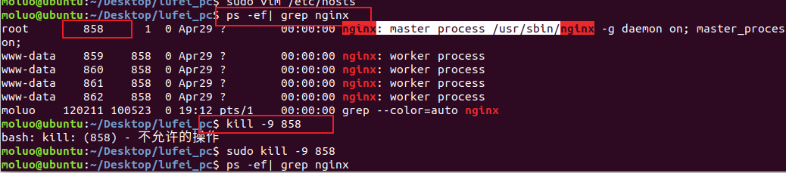
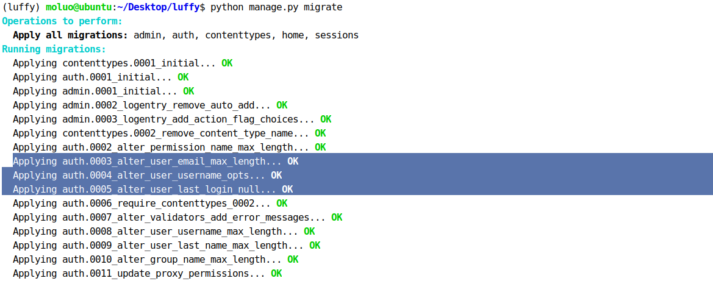
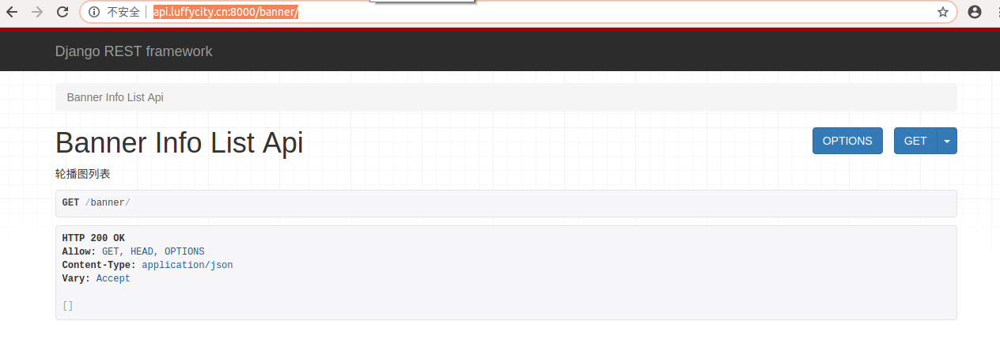
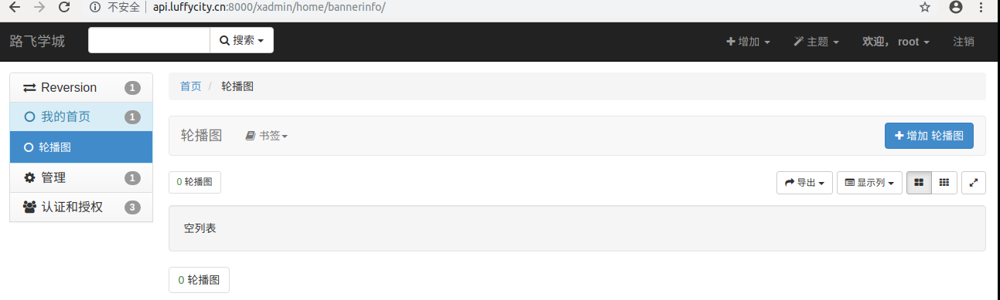

## 二、搭建前端项目

### 2.1 创建项目目录

```python
cd 项目目录
vue init webpack luffycity
```

例如，我要把项目保存在~/Desktop桌面目录下，可以如下操作：

```python 
cd ~/Desktop
vue init webpack luffycity
建议前后端项目保存在同一目录下
```

### 2.2 前端初始化全局变量和全局方法

​	在src目录下创建settings.js站点开发配置文件

```python 
export default {
  	Host:"http://www.luffyapi.com:8000",
}
```

​	在main.js中引入

```python
import settings from './settings'

Vue.prototype.$settings = settings; 
	#将settings中的内容作为vue的属性，以后就不用每次都导包了
```

​	在App.vue中配置全局css初始化代码

```css
body{
    margin: 0;
    padding: 0;
  }
  ul{
    list-style: none;
    padding: 0;
    margin: 0;
  }
  li{
    list-style: none;
  }
  /*.el-header{*/
  /*  width: 1200px;*/
  /*}*/
  input,select,textarea{
    border: none;
    outline: none;
  }
  a{
    text-decoration: none;
    color: #4a4a4a;
  }
```

​	也可以把App.vue的style标签的css代码放到static外部目录下引用过来

main.js

```javascript
import "../static/css/reset.css";
```

### 2.3 跨域CORS

三种解决方式

```python
CORS  JSONP  服务端代理
```


我们现在为前端和后端分别设置两个不同的域名：

| 位置 | 域名               |
| ---- | ------------------ |
| 前端 | `www.luffycity.cn` |
| 后端 | `api.luffycity.cn` |

编辑`/etc/hosts`文件，可以设置本地域名

```bash
sudo vim /etc/hosts
```

在文件中增加两条信息

```shell
127.0.0.1   localhost
127.0.0.1   api.luffycity.cn
127.0.0.1   www.luffycity.cn
```


如果你已经启动了nginx，那么你使用80端口的时候，通过浏览器访问前端vue项目，会出现nginx的欢迎页面，主要因为我们当前操作中已经有一个nginx监听了80端口，所以访问www.luffycity.cn网址时，会自动被转发到127.0.0.1本机，因为没有网址默认端口是80端口，所以被nginx进行处理了当前请求，因此我们暂时先把nginx关闭先。

```bash
# 查找nginx的进程
ps -ef|grep nginx
# 关闭进程
sudo kill -9 nginx进程号
```




关闭了nginx以后，访问www.luffy.cirty.cn网址，效果：


上面并不是错误，而是没人监听了这个地址和端口了，解决方法：

暂停运行前端项目，并修改配置文件config/index.js

```javascript
    host: 'www.luffycity.cn', // can be overwritten by process.env.HOST
    port: 80, // can be overwritten by process.env.PORT, if port is in use, a free one will be determined
    autoOpenBrowser: true,
```

保存修改信息，并重启项目


这样就可以了，现在尽量先不用使用80端口，比较麻烦


通过浏览器访问drf项目,会出现以下错误信息


可以通过settings/dev.py的ALLOWED_HOSTS,设置允许访问

```python
# 设置哪些客户端可以通过地址访问到后端，*代表所有用户
ALLOWED_HOSTS = [
    'api.luffycity.com',
    'www.luffycity.com', #客户端网址也要，将来客户端要访问到服务端的 
]
```


让用户访问的时候，使用api.luffycity.com:8000

```
1. 修改pycharm的manage.py的配置参数
```


现在，前端与后端分处不同的域名，我们需要为后端添加跨域访问的支持

否则前端无法使用axios无法请求后端提供的api数据，我们使用CORS来解决后端对跨域访问的支持。

使用django-cors-headers扩展

```
在 Response(headers={"Access-Control-Allow-Origin":'客户端地址/*'})
```


文档：https://github.com/ottoyiu/django-cors-headers/

安装

```python
pip install django-cors-headers
```

添加应用

```python
INSTALLED_APPS = (
    ...
    'corsheaders',
    ...
)
```

中间件设置【必须写在第一个位置】

```python
MIDDLEWARE = [
    'corsheaders.middleware.CorsMiddleware', #放在中间件的最上面，就是给响应头加上了一个响应头跨域
    ...
]
```

需要添加白名单，确定一下哪些客户端可以跨域。

```python
# CORS组的配置信息

"""
跨域CORS设置
CORS_ORIGIN_ALLOW_ALL为True，指定所有域名（ip）都可以访问后端接口，默认为False
CORS_ORIGIN_WHITELIST指定能够访问后端接口的ip或域名列表
CORS_ORIGIN_WHITELIST = [
    'http://127.0.0.1:8080',
    'http://localhost:8080',
    'http://192.168.13.254:8080'
]
"""
CORS_ORIGIN_ALLOW_ALL = True

CORS_ALLOW_CREDENTIALS = False
# 是否允许ajax跨域请求时携带cookie，False表示不用，我们后面也用不到cookie，所以关掉它就可以了，以防有人通过cookie来搞我们的网站
```


完成了上面的步骤，我们就可以通过后端提供数据给前端使用ajax访问了。

前端使用 axios就可以访问到后端提供给的数据接口，但是如果要附带cookie信息，前端还要设置一下。

前端引入axios插件并配置允许axios发送cookie信息[axios本身也不允许ajax发送cookie到后端]

```
npm i axios -S --registry https://registry.npm.taobao.org
```


在main.js中引用 axios插件

```javascript
import axios from 'axios'; // 从node_modules目录中导入包
// 客户端配置是否允许ajax发送请求时附带cookie，false表示不允许
axios.defaults.withCredentials = false;

Vue.prototype.$axios = axios; // 把对象挂载vue中
```

前端引入Element-UI

```python
官网地址：
	https://element.eleme.cn/#/zh-CN
        
安装：
	npm i element-ui -S
    
配置：
	在main.js中引入
    import ElementUI from 'element-ui';
	import 'element-ui/lib/theme-chalk/index.css';
    
    Vue.use(ElementUI);
```


如果你拷贝前端vue-cli项目到咱们指定目录下，如果运行起来有问题，一些不知名的错误，那么就删除node_modules文件件，然后在项目目录下执行`npm install` 这个指令，重新按照package.json文件夹中的包进行node_modules里面包的下载


## 三、前端页面搭建

### 3.1 轮播图功能实现

#### 	3.1.1 图片处理模块

```python
前面已经安装了，如果没有安装则需要安装
	pip3 install pillow
```

####     3.1.2 上传文件相关配置

由于我们需要在后台上传我们的轮播图图片，所以我们需要在django中配置一下上传文件的相关配置，有了它之后，就不需要我们自己写上传文件，保存文件的操作了，看配置：

```python
# settings.py文件

# 访问静态文件的url地址前缀
STATIC_URL = '/static/'
# 设置django的静态文件目录
STATICFILES_DIRS = [
    os.path.join(BASE_DIR,"static")
]

# 项目中存储上传文件的根目录[暂时配置]，注意，uploads目录需要手动创建否则上传文件时报错
MEDIA_ROOT=os.path.join(BASE_DIR,"uploads")
# 访问上传文件的url地址前缀
MEDIA_URL ="/media/"

```


在django项目中转换上传文件的Url地址，总路由urls.py新增代码：

```python
from django.urls import path, re_path
from django.conf import settings
from django.views.static import serve

urlpatterns = [
  	...
    re_path(r'media/(?P<path>.*)', serve, {"document_root": settings.MEDIA_ROOT}),
]
```


#### 3.1.3注册home子应用

因为当前功能是drf的第一个功能，所以我们先创建一个子应用home，创建在luffyapi/apps目录下


注册home子应用，因为子应用的位置发生了改变，所以为了原来子应用的注册写法，所以新增一个导包路径：

```python
# Build paths inside the project like this: os.path.join(BASE_DIR, ...)
BASE_DIR = os.path.dirname(os.path.dirname(os.path.abspath(__file__)))

# 新增一个系统导包路径
import sys
#sys.path使我们可以直接import导入时使用到的路径，所以我们直接将我们的apps路径加到默认搜索路径里面去，那么django就能直接找到apps下面的应用了
sys.path.insert(0,os.path.join(BASE_DIR,"apps"))


INSTALLED_APPS = [
	# 注意，加上drf框架的注册	
    'rest_framework',
    
    # 子应用
    'home',

]
```

注意，pycharm会路径错误的提示。可以鼠标右键设置apps为 mark dir.... as source root，不推荐，因为这是pycharm提供的。


#### 	3.1.4 创建轮播图模型

在apps/home目录下的models.py中创建表结构

```python
from django.db import models
from luffyapi.utils.models import BaseModel

# Create your models here.


class Banner(BaseModel):
    """轮播广告图模型"""
    # 模型字段
    title = models.CharField(max_length=500, verbose_name="广告标题")
    link = models.CharField(max_length=500, verbose_name="广告链接")
    # upload_to 设置上传文件的保存子目录,将来上传来的文件会存到我们的media下面的banner文件夹下，这里存的是图片地址。
    image_url = models.ImageField(upload_to="banner", null=True, blank=True, max_length=255, verbose_name="广告图片")
    remark = models.TextField(verbose_name="备注信息")
    # is_show = models.BooleanField(default=False, verbose_name="是否显示")  # 将来轮播图肯定会更新，到底显示哪些
    # orders = models.IntegerField(default=1, verbose_name="排序")
    # is_deleted = models.BooleanField(default=False, verbose_name="是否删除")

    # 表信息声明
    class Meta:
        db_table = "ly_banner"
        verbose_name = "轮播广告"
        verbose_name_plural = verbose_name

    # 自定义方法[自定义字段或者自定义工具方法]
    def __str__(self):
        return self.title


```

​		执行数据迁移命令

```python
python manage.py makemigrations
python manage.py migrate
```

效果：



序列化器

```python
# views.py

from rest_framework import serializers
from .models import Banner, Nav


class BannerModelSerializer(serializers.ModelSerializer):
    """轮播广告的序列化器"""

    # 模型序列化器字段声明
    class Meta:
        model = Banner
        fields = ["image_url", "link"]


```

视图代码

```python
# views.py
from django.shortcuts import render

# Create your views here.

from rest_framework.generics import ListAPIView
from .models import Banner, Nav
from .serializers import BannerModelSerializer, NavModelSerializer
from luffyapi.settings import constants


class BannerListAPIView(ListAPIView):  # 自动导包
    """轮播广告视图"""
    queryset = Banner.objects.filter(is_show=True, is_deleted=False).order_by("orders", "id")[
               :constants.BANNER_LENGTH]
    # 没有必要获取所有图片数据，因为有些可能是删除了的、或者不显示的
    # 切片获取数据的时候，我们可以将切片长度设置成配置项
    serializer_class = BannerModelSerializer


```


在settings配置文件夹中创建一个constants.py配置文件，将来里面存放我们所有的一些常量信息配置，比如上面的轮播图数据切片长度

```python
#　轮播的显示数量
BANNER_LENGTH = 5
```


路由代码

```python
# urls.py
from django.urls import path,re_path
from . import views


urlpatterns = [
    path(r"banner/", views.BannerListAPIView.as_view()),
    path(r"nav/header/", views.HeaderNavListAPIView.as_view())
]
```

把home的路由urls.py注册到总路由

```python
from django.contrib import admin
from django.urls import path,re_path,include
from django.conf import settings
from django.views.static import serve

urlpatterns = [
    path('admin/', admin.site.urls),
    re_path(r'media/(?P<path>.*)', serve, {"document_root": settings.MEDIA_ROOT}),
    path('home/', include("home.urls") ),
]

```

访问http://api.luffycity.cn:8000/banner/，效果：



#### 3.1.5 xadmin安装

我们需要有一个后台提供数据.安装xadmin

```python
pip install https://codeload.github.com/sshwsfc/xadmin/zip/django2 -i https://pypi.douban.com/simple/
```

在配置文件中注册如下应用

```python
INSTALLED_APPS = [
    ...
    'xadmin',
    'crispy_forms',
    'reversion',
    ...
]

# 修改使用中文界面
LANGUAGE_CODE = 'zh-Hans'

# 修改时区
TIME_ZONE = 'Asia/Shanghai'
```


xadmin有建立自己的数据库模型类，需要进行数据库迁移

```shell
python manage.py makemigrations
python manage.py migrate
```


在总路由中添加xadmin的路由信息

```python
import xadmin
xadmin.autodiscover()

# version模块自动注册需要版本控制的 Model
from xadmin.plugins import xversion
xversion.register_models()

urlpatterns = [
    path(r'xadmin/', xadmin.site.urls),
]
```


如果之前没有创建超级用户，需要创建，如果有了，则可以直接使用之前的。

```python
python manage.py createsuperuser
```


#### 3.1.6 给xadmin设置基本站点配置信息

```python
import xadmin
from xadmin import views

class BaseSetting(object):
    """xadmin的基本配置"""
    enable_themes = True  # 开启主题切换功能
    use_bootswatch = True

xadmin.site.register(views.BaseAdminView, BaseSetting)

class GlobalSettings(object):
    """xadmin的全局配置"""
    site_title = "路飞学城"  # 设置站点标题
    site_footer = "路飞学城有限公司"  # 设置站点的页脚
    menu_style = "accordion"  # 设置菜单折叠

xadmin.site.register(views.CommAdminView, GlobalSettings)
```


#### 3.1.7 注册轮播图模型到xadmin中


在当前子应用中创建adminx.py，添加如下代码

```python
# 轮播图
from .models import Banner
class BannerModelAdmin(object):
    list_display=["title","orders","is_show"]
    
xadmin.site.register(Banner, BannerModelAdmin)
```


修改后端xadmin中子应用名称

子应用/apps.py

```python
class HomeConfig(AppConfig):
    name = 'home'
    verbose_name = '我的首页'
```

在home这个app下面的``__init__.py``中设置下面的内容

```python
default_app_config = "home.apps.HomeConfig"
```



给轮播图添加测试数据


添加几条测试数据效果：

 

#### 3.1.8 前端代码获取数据

```python

<template>
    <el-carousel indicator-position="outside" height="400px">
      <el-carousel-item v-for="(value,index) in banner_list" :key="value.id">
        <a :href="value.link">
          

        </a>
      </el-carousel-item>
    </el-carousel>


</template>

<script>


export default {
  name: "Banner",
  data(){
    return {
      banner_list:[

      ]
    }

  },
  methods:{
    get_banner_data(){
      this.$axios.get(`${this.$settings.Host}/home/banner`)
        .then((res)=>{

          this.banner_list = res.data;
        })
      .catch((error)=>{

      })
    }
  },
  created(){
    this.get_banner_data();
  },

}
</script>

<style scoped>

</style>

```

### 3.2 导航栏功能实现

#### 3.2.1 创建导航栏模型

​	由于在 创建数据库模型时，有很多字段是重复的，所以我们可以引入一个公共模型【抽象模型，不会在数据迁移的时候为它创建表】保存项目的公共代码库目录下luffyapi/utils/models.py文件中

```python
from django.db import models


class BaseModel(models.Model):
    """公共模型"""
    is_show = models.BooleanField(default=False, verbose_name="是否显示")
    orders = models.IntegerField(default=1, verbose_name="排序")
    is_deleted = models.BooleanField(default=False, verbose_name="是否删除")
    # created_time = models.DateTimeField(auto_now_add=True, verbose_name="添加时间")
    # updated_time = models.DateTimeField(auto_now=True, verbose_name="修改时间")

    # 更新：update方法不能自动更新auto_now的时间，save()方法保存能够自动修改更新时间
    class Meta:
        # 设置当前模型为抽象模型，在数据迁移的时候django就不会为它单独创建一张表
        abstract = True

```

然后在models.py中可以直接继承公共模型类

```python
from django.db import models
# 注意需要导入模块
from luffyapi.utils.models import BaseModel

.......

# 添加以下代码，创建导航栏菜单模型
class Nav(BaseModel):
    """导航菜单模型"""
    POSITION_OPTION = (
        (1, "顶部导航"),
        (2, "脚部导航"),
    )
    title = models.CharField(max_length=500, verbose_name="导航标题")
    link = models.CharField(max_length=500, verbose_name="导航链接")
    position = models.IntegerField(choices=POSITION_OPTION, default=1, verbose_name="导航位置")
    is_site = models.BooleanField(default=False, verbose_name="是否是站外地址")

    class Meta:
        db_table = 'ly_nav'
        verbose_name = '导航菜单'
        verbose_name_plural = verbose_name

    # 自定义方法[自定义字段或者自定义工具方法]
    def __str__(self):
        return self.title

```


数据迁移

```python
python manage.py makemigrations
python manage.py migrate
```

#### 3.2.2 序列化器代码

```python
from .models import Nav

class NavModelSerializer(serializers.ModelSerializer):
    """导航菜单栏序列化"""
    class Meta:
        model = Nav
        fields = ["title", "link", "is_site"]
```


#### 3.2.3 视图代码


```python
#views.py

from django.shortcuts import render
from rest_framework.generics import ListAPIView
from .models import Banner
from .serializers import BannerModelSerializer
from luffyapi.settings import constants

class BannerListAPIView(ListAPIView): # 自动导包
    """轮播广告视图"""
    queryset = Banner.objects.filter(is_show=True, is_deleted=False).order_by("-orders","-id")[:constants.BANNER_LENGTH]
    serializer_class = BannerModelSerializer

from .models import Nav
from .serializers import NavModelSerializer

class HeaderNavListAPIView(ListAPIView):
    """顶部导航菜单视图"""
    queryset = Nav.objects.filter(is_show=True, is_deleted=False, position=1).order_by("orders", "id")[
               :constants.HEADER_NAV_LENGTH]
    serializer_class = NavModelSerializer
```

#### 3.2.4 常量配置

settings/constants.py，代码：

```python
# 首页展示的轮播广告数量
BANNER_LENGTH = 5
# 顶部导航的数量
HEADER_NAV_LENGTH = 3
# 脚部导航的数量
FOOTER_NAV_LENGTH = 3
```


#### 3.2.5 路由代码

urls.py

```python
from django.urls import path,re_path
from . import views
urlpatterns = [
    path("banner/",views.BannerListAPIView.as_view()),
    path("nav/header/", views.HeaderNavListAPIView.as_view()),
    #path("nav/footer/", views.FooterNavListAPIView.as_view()),
]
```


#### 3.2.6 注册导航模型到xadmin中

在当前子应用adminx.py，添加如下代码

```python
import xadmin
from xadmin import views

class BaseSetting(object):
    """xadmin的基本配置"""
    enable_themes = True  # 开启主题切换功能
    use_bootswatch = True

xadmin.site.register(views.BaseAdminView, BaseSetting)

class GlobalSettings(object):
    """xadmin的全局配置"""
    site_title = "路飞学城"  # 设置站点标题
    site_footer = "路飞学城有限公司"  # 设置站点的页脚
    menu_style = "accordion"  # 设置菜单折叠

xadmin.site.register(views.CommAdminView, GlobalSettings)


# 轮播图
from .models import Banner
class BannerModelAdmin(object):
    list_display=["title","orders","is_show"]
xadmin.site.register(Banner, BannerModelAdmin)

# 导航菜单
from home.models import Nav
class NavModelAdmin(object):
    list_display=["title","link","is_show","is_site","position"]
xadmin.site.register(Nav, NavModelAdmin)
```

添加测试数据


#### 3.2.7 客户端代码获取数据

```python
<template>
  <div class="total-header">
    <div class="header">
    <el-container>
      <el-header height="80px" class="header-cont">
        <el-row>
          <el-col class="logo" :span="3">
            <a href="/">
              

            </a>
          </el-col>
          <el-col class="nav" :span="10">
            <el-row>
                <el-col :span="3" v-for="(value,index) in nav_data_list" :key="value.id">

                  <router-link v-if="!value.is_site" :to="value.link" :class="{active:count===index}" @click="count=index">{{value.title}}</router-link>
                  <a v-else :href="value.link" :class="{active:count===index}">{{value.title}}</a>

                </el-col>

              </el-row>

          </el-col>
          <el-col :span="11" class="header-right-box">
            <div class="search">
              <input type="text" id="Input" placeholder="请输入想搜索的课程" style="" @blur="inputShowHandler" ref="Input" v-show="!s_status">
              <ul @click="ulShowHandler" v-show="s_status" class="search-ul">
                <span>Python</span>
                <span>Linux</span>
              </ul>
              <p>
                
                
                
              </p>
            </div>
            <div class="register" v-show="!token">
              <router-link to="/"><button class="signin">登录</button></router-link>
              &nbsp;&nbsp;|&nbsp;&nbsp;
<!--              <a target="_blank" href="">-->
                <router-link to="/"><button class="signup">注册</button></router-link>

<!--              </a>-->
            </div>
            <div class="shop-car" v-show="token">
              <router-link to="/">
                <b>6</b>
                
                <span>购物车 </span>
              </router-link>
            </div>
            <div class="nav-right-box" v-show="token">
                <div class="nav-right">
                  <router-link to="/">
                    <div class="nav-study">我的教室</div>
                  </router-link>
                  <div class="nav-img" @mouseover="personInfoList" @mouseout="personInfoOut">
                    
<!--                    hover &#45;&#45; mouseenter+mouseout-->
                    <ul class="home-my-account" v-show="list_status">
                      <li>
                        我的账户
                        
                      </li>
                      <li>
                        我的订单
                        
                      </li>
                      <li>
                        贝里小卖铺
                        
                      </li>
                      <li>
                        我的优惠券
                        
                      </li>
                      <li>
                        <span>
                          我的消息
                          <b>(26)</b>
                        </span>
                        
                      </li>
                      <li>
                        退出
                        
                      </li>

                    </ul>
                  </div>

                </div>

              </div>


          </el-col>
        </el-row>

      </el-header>


    </el-container>

  </div>
  </div>

</template>

<script>
    export default {
      name: "Header",
      data(){
        return {
          // 设置一个登录状态的标记，因为登录注册部分在登录之后会发生变化,false未登录转台
          token:true,
          count:0, //标记导航栏中哪一个有class类值为active的值
          s_status:true, //用来标记搜索框是否显示成input框
          list_status:false, //用来控制个人中心下拉菜单的动态显示，false不显示
          nav_data_list:[],
        }
      },
      methods:{
        ulShowHandler(){
          this.s_status = false;
          console.log(this.$refs.Input);

          // this.$refs.Input.focus();
          this.$nextTick(()=>{
            this.$refs.Input.focus();
          })

        },
        inputShowHandler(){
          console.log('xxxxx')
          this.s_status = true;
        },
        personInfoList(){
          this.list_status = true;
        },
        personInfoOut(){
          this.list_status = false;
        },
        get_nav_data(){
          this.$axios.get(`${this.$settings.HOST}/nav/header/`,).then((res)=>{
            console.log(res.data);
            this.nav_data_list = res.data;
          })
          .catch((error)=>{
            console.log(error);
          })
        }
      },

      created() {
        this.get_nav_data();
      }

    }


</script>

<style scoped>
  .header-cont .nav .active{
    color: #f5a623;
    font-weight: 500;
    border-bottom: 2px solid #f5a623;
  }
  .total-header{
    min-width: 1200px;
    z-index: 100;
    box-shadow: 0 4px 8px 0 hsla(0,0%,59%,.1);
  }
  .header{
    width: 1200px;
    margin: 0 auto;
  }
  .header .el-header{
    padding: 0;
  }
  .logo{
    height: 80px;
    /*line-height: 80px;*/
    /*text-align: center;*/
    display: flex; /* css3里面的弹性布局，高度设定好之后，设置这个属性就能让里面的内容居中 */
    align-items: center;
  }
  .nav .el-row .el-col{
    height: 80px;
    line-height: 80px;
    text-align: center;

  }
  .nav a{
    font-size: 15px;
    font-weight: 400;
    cursor: pointer;
    color: #4a4a4a;
    text-decoration: none;
  }
  .nav .el-row .el-col a:hover{
    border-bottom: 2px solid #f5a623
  }

  .header-cont{
    position: relative;
  }
  .search input{
    width: 185px;
    height: 26px;
    font-size: 14px;
    color: #4a4a4a;
    border: none;
    border-bottom: 1px solid #ffc210;

    outline: none;
  }
  .search ul{
    width: 185px;
    height: 26px;
    display: flex;
    align-items: center;
    padding: 0;

    padding-bottom: 3px;
    border-bottom: 1px solid hsla(0,0%,59%,.25);
    cursor: text;
    margin: 0;
    font-family: Helvetica Neue,Helvetica,Microsoft YaHei,Arial,sans-serif;
  }
  .search .search-ul,.search #Input{
    padding-top:10px;
  }
  .search ul span {
    color: #545c63;
    font-size: 12px;
    padding: 3px 12px;
    background: #eeeeef;
    cursor: pointer;
    margin-right: 3px;
    border-radius: 11px;
  }
  .hide{
    display: none;
  }
  .search{
    height: auto;
    display: flex;
  }
  .search p{
    position: relative;
    margin-right: 20px;
    margin-left: 4px;
  }

  .search p .icon{
    width: 16px;
    height: 16px;
    cursor: pointer;
  }
  .search p .new{
    width: 18px;
    height: 10px;
    position: absolute;
    left: 15px;
    top: 0;
  }
  .register{
    height: 36px;
    display: flex;
    align-items: center;
    line-height: 36px;
  }
  .register .signin,.register .signup{
    font-size: 14px;
    color: #5e5e5e;
    white-space: nowrap;
  }
  .register button{
    outline: none;
    cursor: pointer;
    border: none;
    background: transparent;
  }
  .register a{
    color: #000;
    outline: none;
  }
  .header-right-box{
    height: 100%;
    display: flex;
    align-items: center;
    font-size: 15px;
    color: #4a4a4a;
    position: absolute;
    right: 0;
    top: 0;
  }
  .shop-car{
    width: 99px;
    height: 28px;
    border-radius: 15px;
    margin-right: 20px;
    background: #f7f7f7;
    display: flex;
    align-items: center;
    justify-content: center;
    position: relative;
    cursor: pointer;
  }
  .shop-car b{
    position: absolute;
    left: 28px;
    top: -1px;
    width: 18px;
    height: 16px;
    color: #fff;
    font-size: 12px;
    font-weight: 350;
    display: flex;
    justify-content: center;
    align-items: center;
    border-radius: 50%;
    background: #ff0826;
    overflow: hidden;
    transform: scale(.8);
  }
  .shop-car img{
    width: 20px;
    height: 20px;
    margin-right: 7px;
  }

  .nav-right-box{
    position: relative;
  }
  .nav-right-box .nav-right{
    float: right;
    display: flex;
    height: 100%;
    line-height: 60px;
    position: relative;
  }
  .nav-right .nav-study{
    font-size: 15px;
    font-weight: 300;
    color: #5e5e5e;
    margin-right: 20px;
    cursor: pointer;

  }
  .nav-right .nav-study:hover{
    color:#000;
  }
  .nav-img img{
    width: 26px;
    height: 26px;
    border-radius: 50%;
    display: inline-block;
    cursor: pointer;
  }
  .home-my-account{
    position: absolute;
    right: 0;
    top: 60px;
    z-index: 101;
    width: 190px;
    height: auto;
    background: #fff;
    border-radius: 4px;
    box-shadow: 0 4px 8px 0 #d0d0d0;
  }
  li{
    list-style: none;
  }
  .home-my-account li{
    height: 40px;
    font-size: 14px;
    font-weight: 300;
    color: #5e5e5e;
    padding-left: 20px;
    padding-right: 20px;
    cursor: pointer;
    display: flex;
    align-items: center;
    justify-content: space-between;
    box-sizing: border-box;
  }
  .home-my-account li img{
    cursor: pointer;
    width: 5px;
    height: 10px;
  }
  .home-my-account li span{
    height: 40px;
    display: flex;
    align-items: center;
  }
  .home-my-account li span b{
    font-weight: 300;
    margin-top: -2px;
  }

</style>
```

#### 3.2.8 底部导航栏

```python

```

