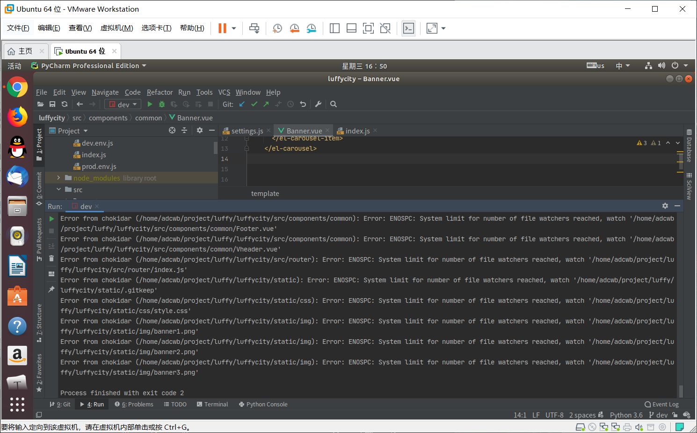

## 一、项目搭建

### 1.1 外部依赖

1.  注册支付宝的开发者账号[https://open.alipay.com]，注册一下账号就可以了，剩下的以后再说
2.  注册容联云短信接口平台的账号[https://www.yuntongxun.com/?ly=baidu-pz-p&qd=cpc&cp=ppc&xl=null&kw=10360228]
3.  注册保利威视频服务平台的账号[暂时别注册,因为有个7天免费测试期，如果到时候过期了就没法用了,网址：[http://www.polyv.net/?f=baiduPZ&utm_term=%E4%BF%9D%E5%88%A9%E5%A8%81](http://www.polyv.net/?f=baiduPZ&utm_term=保利威)]
4.  注册gitee[码云]的账号
5.  注册阿里云账号,如果可以购买一个服务器和域名, 或者第一次使用的可以申请一个免费外网服务器
6.  如果有条件的,可以申请一个域名进行备案[ICP备案和公安部备案],如果没有的话, 可以注册natapp[内网穿透]

### 1.2 依赖包安装

```python
pip install django -i https://pypi.douban.com/simple/ #注意：在虚拟环境中安装第三方包的时候，不要使用sudo，因为sudo是以管理员身份来安装，会将安装的东西安装到全局中去，而不是在虚拟环境中，并且在linux系统下不要出现中文路径

pip install djangorestframework -i https://pypi.douban.com/simple/

pip install PymySQL -i https://pypi.douban.com/simple/

pip install Pillow -i https://pypi.douban.com/simple/

pip install django-redis -i https://pypi.douban.com/simple/
```

### 1.3 项目创建

```python
cd ~/Desktop
mkdir luffy
cd luffy
django-admin startproject luffyapi
```

### 1.4 项目目录调整

```python
luffy/
  ├── docs/          # 项目相关资料保存目录
  ├── luffycity/     # 前端项目目录
  ├── luffyapi/      # 后端项目目录
       ├── logs/          # 项目运行时/开发时日志目录
       ├── manage.py
       ├── luffyapi/      # 项目主应用，开发时的代码保存
       │    ├── apps/      # 开发者的代码保存目录，以模块[子应用]为目录保存（包）
       │    ├── libs/      # 第三方类库的保存目录[第三方组件、模块]（包）
       │    ├── settings/  #（包）
       │         ├── dev.py   # 项目开发时的本地配置
       │         ├── prod.py  # 项目上线时的运行配置
       │         ├── test.py  # 测试人员使用的配置(咱们不需要)
       │    ├── urls.py    # 总路由（包）
       │    ├── utils/     # 多个模块[子应用]的公共函数类库[自己开发的组件]
       └── scripts/       # 保存项目运营时的脚本文件
```

在编辑中开发项目时,必须指定项目目录才能运行,例如,开发后端项目,则必须选择的目录是luffyapi

```python
上面的目录结构图，使用Ubuntu的命令tree输出的。
如果没有安装tree，可以使用 sudo apt install tree，就有了。

注意：创建文件夹的时候，是创建包(含init.py文件的)还是创建单纯的文件夹，看目录里面放的是什么，如果放的是py文件相关的代码，最好创建包，如果不是，那就创建单纯的文件夹。
```

### 1.5 配置git

```python

```

### 1.6 日志配置

​	在settings/dev.py文件中追加如下配置：

```python
# 日志配置
LOGGING = {
    'version': 1,  #使用的python内置的logging模块，那么python可能会对它进行升级，所以需要写一个版本号，目前就是1版本
    'disable_existing_loggers': False, #是否去掉目前项目中其他地方中以及使用的日志功能，但是将来我们可能会引入第三方的模块，里面可能内置了日志功能，所以尽量不要关闭。
    'formatters': { #日志记录格式
        'verbose': { #levelname等级，asctime记录时间，module表示日志发生的文件名称，lineno行号，message错误信息
            'format': '%(levelname)s %(asctime)s %(module)s %(lineno)d %(message)s'
        },
        'simple': {
            'format': '%(levelname)s %(module)s %(lineno)d %(message)s'
        },
    },
    'filters': { #过滤器：可以对日志进行输出时的过滤用的
        'require_debug_true': { #在debug=True下产生的一些日志信息，要不要记录日志，需要的话就在handlers中加上这个过滤器，不需要就不加
            '()': 'django.utils.log.RequireDebugTrue',
        },
        'require_debug_false': { #和上面相反
            '()': 'django.utils.log.RequireDebugFalse',
        },
    },
    'handlers': { #日志处理方式，日志实例
        'console': { #在控制台输出时的实例
            'level': 'DEBUG', #日志等级；debug是最低等级，那么只要比它高等级的信息都会被记录
            'filters': ['require_debug_true'], #在debug=True下才会打印在控制台
            'class': 'logging.StreamHandler', #使用的python的logging模块中的StreamHandler来进行输出
            'formatter': 'simple'
        },
        'file': {
            'level': 'INFO',
            'class': 'logging.handlers.RotatingFileHandler',
            # 日志位置,日志文件名,日志保存目录必须手动创建
            'filename': os.path.join(os.path.dirname(BASE_DIR), "logs/luffy.log"), #注意，你的文件应该有读写权限。
            # 日志文件的最大值,这里我们设置300M
            'maxBytes': 300 * 1024 * 1024,
            # 日志文件的数量,设置最大日志数量为10
            'backupCount': 10,
            # 日志格式:详细格式
            'formatter': 'verbose',
          	'encoding': 'utf-8',  # 设置默认编码，否则打印出来汉字乱码
        },
    },
    # 日志对象
    'loggers': {
        'django': {  #和django结合起来使用，将django中之前的日志输出内容的时候，按照我们的日志配置进行输出，
            'handlers': ['console', 'file'], #将来项目上线，把console去掉
            'propagate': True, #冒泡：是否将日志信息记录冒泡给其他的日志处理系统，工作中都是True，不然django这个日志系统捕获到日志信息之后，其他模块中可能也有日志记录功能的模块，就获取不到这个日志信息了
        },
    }
}
```

### 1.7 异常处理

​	新建utils/exceptions.py

```python
from rest_framework.views import exception_handler
from django.db import DatabaseError
from rest_framework.response import Response
from rest_framework import status

import logging
logger = logging.getLogger('django')


def custom_exception_handler(exc, context):
    """
    自定义异常处理
    :param exc: 异常类
    :param context: 抛出异常的上下文
    :return: Response响应对象
    """
    # 调用drf框架原生的异常处理方法
    response = exception_handler(exc, context)

    if response is None:
        view = context['view']
        if isinstance(exc, DatabaseError):
            # 数据库异常
            logger.error('[%s] %s' % (view, exc))
            response = Response({'message': '服务器内部错误'}, status=status.HTTP_507_INSUFFICIENT_STORAGE)

        if isinstance(exc,Exception):
            # 未知异常
            logger.error("发生未知异常。view=%s，exc=%s" % (view, exc))
            response = Response({'detail': '服务器出现未知错误'}, status=status.HTTP_500_INTERNAL_SERVER_ERROR)

    return response
```

settings.py配置文件中添加

```python
REST_FRAMEWORK = {
    # 异常处理
    'EXCEPTION_HANDLER': 'luffyapi.utils.exceptions.custom_exception_handler',
}
```


### 1.8 创建数据库

​	创建数据库的时候，因为utf-8编码格式对于一些繁体字支持不太友好，所以使用uft8mb4格式

```mysql
create database luffyapi default charset=utf8mb4;
```

​	为当前项目创建数据库用户[这个用户只能看到这个数据库]

```mysql
# create user 用户名 identified by '登录密码';       # 创建用户

# grant 权限 on 数据库名.表名 to '用户名'@'登录主机';   # 赋予权限给用户
# * 可以表示任意数据库，也可以表示任意表，也可以表示任意登录主机
# all privileges 表示所有权限，也可以设置 单个权限或多个权限
# grant select,insert,update,delete on ....  # 只赋予增删查改的权限
# grant select on ...   # 只赋予查询权限

# flush privileges;                                # 刷新权限

create user luffy identified by '123456';
grant all privileges on luffyapi.* to 'luffy'@'*';
flush privileges;
```


### 1.9 配置数据库连接

打开settings/dev.py文件，并配置

```python
DATABASES = {
    "default": {
        "ENGINE": "django.db.backends.mysql",
        "HOST": "127.0.0.1",
        "PORT": 3306,
        "USER": "luffy",
        "PASSWORD": "123456",
        "NAME": "luffyapi",
    }
}
```


在项目主模块的 `__init__.py`中导入pymysql

```python
import pymysql

pymysql.install_as_MySQLdb()
```


#### 调整错误

数据库版本检测导致的错误


数据库的版本检测代码注释掉。


第二个错误也是因为数据库版本的默认编码导致，query返回的内容格式使用有误。

新增一行代码，把query查询结果转换格式为 bytes类型


luffyapi项目后端基本就配置完了，下面搞一下前端客户端。

注意：在ubuntu中打开项目时候，尽量先打开前端项目，再打开后端项目，不然的话可能打开项目的时候会卡死，若遇到卡死的情况，建议杀死pycharm进程重新运行，要是还不行的话，建议卸载搜狗输入法

```python
查找pycharm进程
	sudo ps aux | grep pycharm 
杀死进程
	kill -9 进程id
```


超出系统最大文件打开限制报错



解决方法：

```python
Ubuntu修改系统监控文件数量
	sudo gedit /etc/sysctl.conf
添加一行在最下面
	fs.inotify.max_user_watches=524288
然后保存退出，执行
	sudo sysctl -p
```

